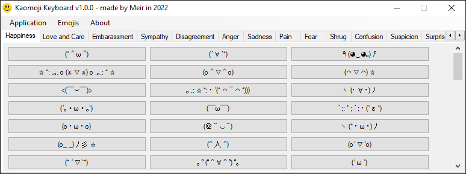
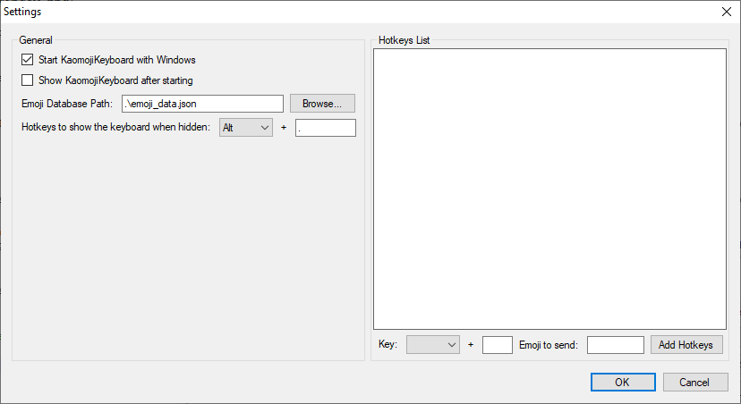
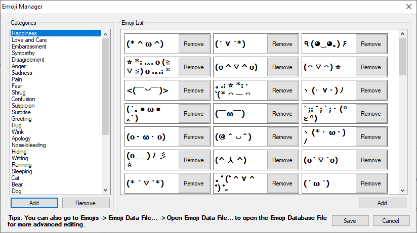

# Kaomoji Keyboard



A simple keyboard for sending Japanese emoticons (Kaomoji) to anywhere.

## Download
You can download the latest release [here](https://www.github.com/LilShieru/KaomojiKeyboard/releases).

## How to install?
This software is originally portable (just download the ZIP file and click `KaomojiKeyboard.exe` to run), but you can also download the installer version (`KaomojiKeyboard.Installer.exe`) to install this software like another software.

.NET Framework 4.0 is required before installing this software.

## How to use?

### Sending emoticons
Just run the KaomojiKeyboard software and click an emoji to send it to the focused textbox. You can also switch to another category in another tab to send emojis fitted with the selected category.

### Showing/hiding the keyboard
To hide the keyboard, simply click the X button and it will automatically hide and run under the background. To show the keyboard when hiding, click the <kbd>Alt</kbd> + <kbd>X</kbd> button or the configured hotkeys in the Settings part.

### Exit the application
This app will run under background in default (clicking the X button), but you can exit the application using the `Application -> Exit` button.

### Settings
You can go to the `Application -> Settings` part to open the Settings window.



* **Start KaomojiKeyboard with Windows:** If checked, this software will automatically start when Windows starts.

* **Show KaomojiKeyboard after starting:** If checked, the keyboard will be shown after successfully starting (both on Windows startup and manually).

* **Emoji Database Path:** The path to the current `emoji_data.json` database file. Default is `.\emoji_data.json`, which leads to the `emoji_data.json` file in the same folder with the application.

* **Hotkeys to show the keyboard when hidden:** The hotkeys to show the keyboard after hiding. Default is <kbd>Alt</kbd> + <kbd>X</kbd>

* **Hotkeys List:** The hotkeys to send emojis set by the user. You can add as many hotkeys as you want, just make sure that it isn't as same as other hotkeys set before or Windows' default hotkeys.

After that, click OK to save the settings.

#### The `settings.json` file:
You can also open the `settings.json` file in the same folder as the application to edit it manually.

The original JSON file will be like this:

```json
{
  "emoji_data_path": ".\\emoji_data.json",
  "show_window_when_start": true
}
```

* `emoji_data_path:` The path to the current `emoji_data.json` database file. Default is `.\emoji_data.json`, which leads to the `emoji_data.json` file in the same folder with the application.

* `show_window_when_start:` If `true`, the keyboard will be shown after successfully starting (both on Windows startup and manually).

#### The `hotkeys.json` file:
You can also open the `hotkeys.json` file in the same folder as the application to manually add hotkeys.

The original JSON file will be like this:

```json
{
  "show_keyboard": {
    "key": "1.OemPeriod"
  }
}
```

* **show_keyboard:** The hotkeys used for showing the keyboard after hiding, whose the `key` property will be the key to show keyboard with the KaomojiHotKey scheme.

* You can also add your custom hotkeys by creating an object with the object key is the KaomojiHotKey scheme, and the object value is a nested object with these properties:

| Property | Type | Description |
| --- | --- | --- |
| `type` | string | The type of the configured hotkeys, more options will be added later.\n- `emoji` if the configured hotkeys are to send an emoji. |
| `emoji` | string | If `type` is `emoji`, this property will be used to configured the emoji that will be sent if the user presses the configured hotkeys. |

**Example of a hotkey object that send the emoji `(* ^ ω ^)` if the user presses <kbd>Alt</kbd> + <kbd>A</kbd>:**

```json
{
  "1.A": {
    "type": "emoji",
    "emoji": "(* ^ ω ^)"
  }
}
```

And the entire JSON file will be like this:

```json
{
  "show_keyboard": {
    "key": "1.OemPeriod"
  },
  "1.A": {
    "type": "emoji",
    "emoji": "(* ^ ω ^)"
  }
}
```

#### KaomojiHotKey Scheme
`String`: `"<Modifier>.<Keys>"`

| Part | Description |
| --- | --- |
| `<Modifier>` | - `1` if the first key is <kbd>Alt</kbd>.<br>- `2` if the first key is <kbd>Shift</kbd>.<br>- `4` if the first key is <kbd>Control</kbd>.<br>- `8` if the first key is <kbd>Windows</kbd>. |
| `<Keys>` | The second .NET key (from the Fields part in the [.NET Keys Enum](https://docs.microsoft.com/en-us/dotnet/api/system.windows.forms.keys) documentation).

### Emoji Manager (`Emojis -> Emoji Manager...`)
You can add or remove emojis in the database using the Emoji Manager.



* The `Categories` part will list all the emoji categories in the emoji database. You can add or remove a category as you want.

* The `Emoji List` part will list all the emojis in the selected category. You can also add or remove an emoji in the selected category.

After that, click the `Save` button to save the emoji database.

#### The `emoji_data.json` file
You can also edit the emoji database by editing the `emoji_data.json` file using the `Emojis -> Emoji Data File... -> Open Emoji Data File...` button.

The JSON file will contain objects, each object will be a category with an array containing all of the emojis in it, for example:

```json
{
  "Games": [
    "(^^) p _____ | _o ____ q (^^)",
    "(／ O ^) / ° ⊥ ＼ (^ o＼)",
    "! (; ﾟ o ﾟ) o / ￣￣￣￣￣￣￣ ~> ﾟ)))) 彡",
    "ヽ (^ o ^) ρ┳┻┳ ° σ (^ o ^) ノ",
    "(／ _ ^) ／ ● ＼ (^ _ ＼)",
    "“((≡ | ≡)) _ ／ ＼ _ ((≡ | ≡))”",
    "(ノ -_-) ノ ﾞ _ □ VS □ _ ヾ (^ – ^ ヽ)",
    "ヽ (； ^ ^) ノ ﾞ ．．．…___ 〇",
    "(= O * _ *) = OQ (* _ * Q)",
    "Ю ○ 三 ＼ (￣ ^ ￣＼)"
  ],
  "Faces": [
    "(͡ ° ͜ʖ ͡ °)",
    "(͡ ° ʖ̯ ͡ °)",
    "(͠ ° ͟ʖ ͡ °)",
    "(͡ᵔ ͜ʖ ͡ᵔ)",
    "(. • ́ _ʖ • ̀.)",
    "(ఠ ͟ʖ ఠ)",
    "(͡ಠ ʖ̯ ͡ಠ)",
    "(ಠ ʖ̯ ಠ)",
    "(ಠ ͜ʖ ಠ)",
    "(ಥ ʖ̯ ಥ)",
    "(͡ • ͜ʖ ͡ •)",
    "(･ ิ ͜ʖ ･ ิ)",
    "(͡ ͜ʖ ͡)",
    "(≖ ͜ʖ≖)",
    "(ʘ ʖ̯ ʘ)",
    "(ʘ ͟ʖ ʘ)",
    "(ʘ ͜ʖ ʘ)",
    "(; ´ ༎ ຶ ٹ ༎ ຶ `)"
  ]
}
```

You can add, edit or move emojis and categories in this file (which isn't supported in the Emoji Manager) as you want, as well as the file is a valid JSON file.

### Refreshing the emoji data (`Emojis -> Refresh Emoji Data...`)
This command will refresh the emoji database from the `emoji_data.json` file if the user edited it manually using the text editor.

### Opening/showing location of the Emoji Data File (`Emojis -> Emoji Data File...`)
* **Open Emoji Data File...:** Open the `emoji_data.json` file using Notepad.

* **Show Emoji Data File Location...:** Show the current location of the `emoji_data.json` file in Explorer.

### Resetting the emoji data (`Emojis -> Reset Emoji Data...`)
This command will reset the `emoji_data.json` file to the default emoji database in the application code. This command can't be undone.

## Building from source
This software is written in C# using Microsoft Visual C# 2010 Express with .NET Framework 4.0, so make sure you have Visual Studio 2010 or later to edit and build this software from the given source code.

Just open the project from the `KaomojiKeyboard.sln` file and you can edit it freely without any limitations.

## About
```
Current version: v1.0.0

Build date: February 16, 2022

Made by Meir/Nico Levianth/LilShieru/S1est4.


Default database is crawled from: https://kynguyencongnghe.com/tong-hop-kaomoji-japanese-emoticons

I also copied some scripts from StackOverflow, shout out to ones who made it (I don't remember them) :')

Also, shout out to Facebook/100076324843858 for the idea!

Made with Microsoft Visual C# 2010 Express on Windows 10 20H2.


[GitHub]

Source code: https://www.github.com/LilShieru/KaomojiKeyboard

User: https://www.github.com/LilShieru
```
